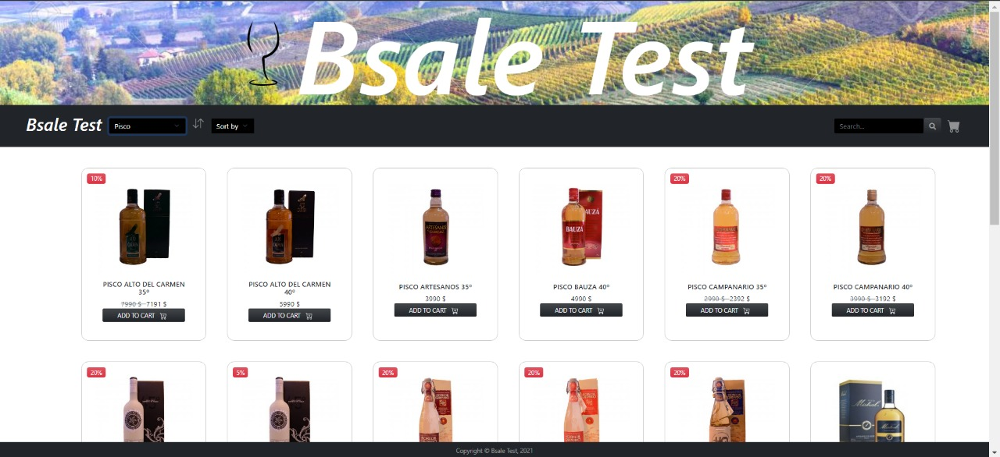

# Desafío Interfaz de adaptadores

## Índice

- [1. Descripción general](#1-descripción-general)
- [2. Implementación](#2-implementación)
- [3. Diseño](#3-diseño)
- [4. Interfaz](#4-interfaz)
- [5. Instalación](#5-instalación)
- [6. Modo de uso](#6-modo-de-uso)
- [7. Tecnologías](#7-tecnologías)
- [8. Enlace web](#8-enlace-web)

---

## 1. Descripción general

Bsale Test, tienda online en donde se puede visualizar productos agrupados por categoría a la que pertenecen. 

## 2. Implementación

Aplicación desarrollada con vanilla Javascript ES6, con uso de Bootstrap 5 y CSS para el diseño y estilo.

La implementación del backend fue desarrollada utilizando tecnologias como Javascript ES6, Node.js, Express, mySQL:

## Buscador de Productos

    A través del método GET, la API REST es capaz de obtener la información almacenada por la base de datos.

## Seleccion de Categoria.

    A través del método GET, la API REST devuelve la información de las Categorias de los productos, para poder ser manipulada en el frontend.

## Buscador de Productos por categorias

    A través del método GET, la API REST es capaz de devolver los productos requeridos que pertenecen a la categoria solicitada en el parámetro(nombre de la categoria) mediante el frontend.

## 3. Diseño

El diseño se baso en un estilo minimalista. La paleta de colores está constituida por negro ceniza, para denotar clase, estilo, seriedad y sofisticación de manera sutil en ciertos elementos de la plataforma. También esta el rojo para resaltar y llamar la atención del usuario en los descuentos del producto. Y finalmente predomina el blanco de fondo para enfatizar cada uno de los componentes de la página, 

## 4. Interfaz



## 5. Instalación

- Es necesario  ejecutar los siguientes comandos en la raiz del proyecto:

```
$ npm install
```

- Se instalaran todas las dependencia y con el siguiente comando ejecutaremos la API

```
$ npm run start
```
## 6. Modo de uso

Al acceder a la plataforma se puede visualizar todos los productos disponibles de la tienda online, los cuales se pueden buscar por categoria (bebidas, bebidas energéticas, cerveza, pisco, ron, snack, vodka) y a su vez ordenar alfabéticamente. En cada _card_ se puede visualizar la imagen, nombre y precio de cada producto. También se especifica si el producto tiene descuento, se determina: el porcentaje de descuento, precio anterior y el precio con descuento.

## 7. Tecnologías

* Javascript ES6.
* Bootstrap 5.
* HTML5.
* CSS.
* Node.js.
* Express.
* MySQL.

## 8. Enlace web

Enlace web del Frontend: [https://front-end-bsale.herokuapp.com/](https://front-end-bsale.herokuapp.com/).

Enlace web del backend: [https://back-end-bsale.herokuapp.com/](https://back-end-bsale.herokuapp.com/).
